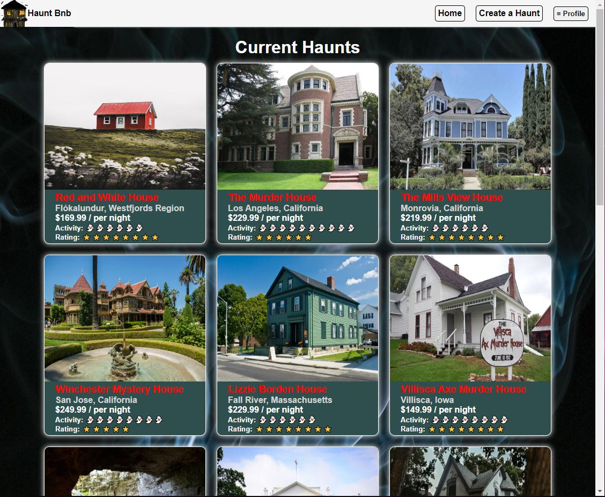
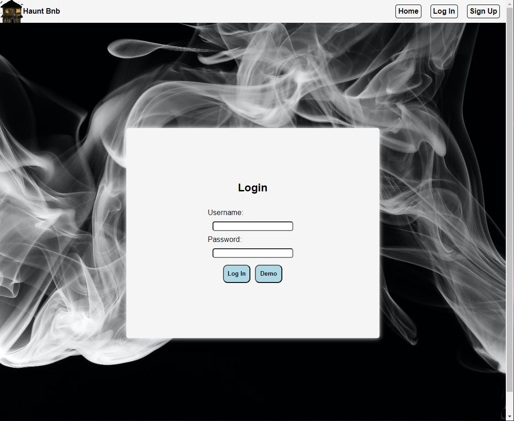
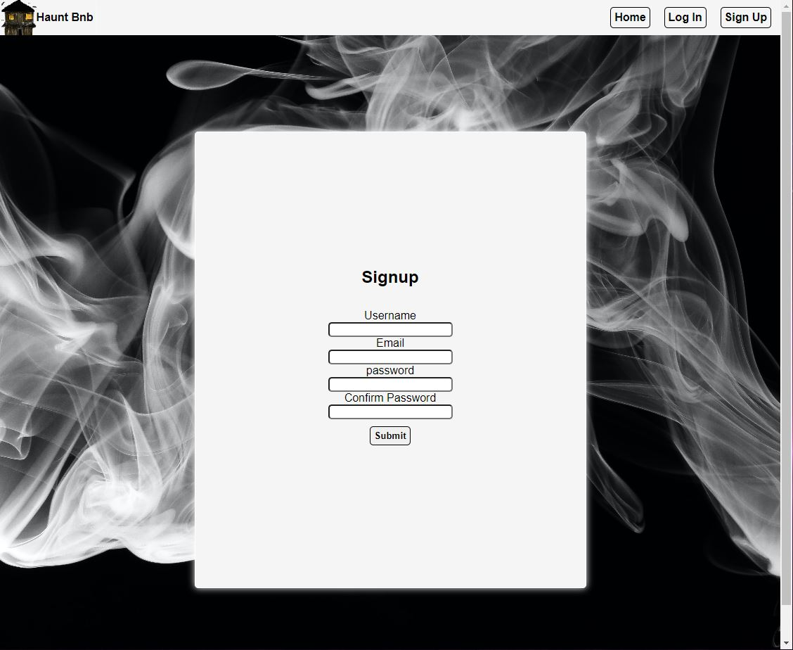
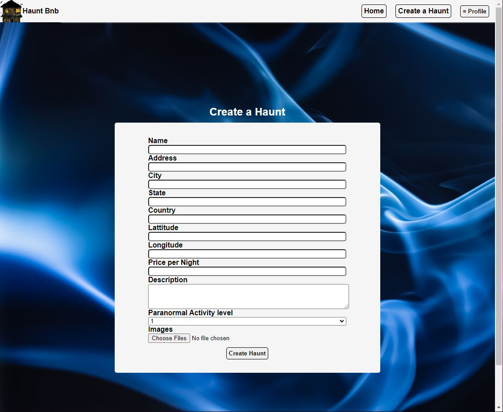

# HauntBnB

## Snapshot
Hauntbnb is a fullstack airbnb clone with a spooky theme! It takes the idea of being able to book spots to stay at, but more specifically at haunted locations!

Live Link:
[👻Boo!][site-url]

## Features
### Haunts
- Users can create Haunts as locations to be viewed
- Each haunt has a paranormal activity rating as well as an averaged comfort rating based on user reviews
- Owners of the haunt can edit the data, or delete the haunt from the list of available locations

### Reviews
- Users may leave a single review for each haunt
- Each review can choose a comfort rating, as well as a written review
- Users are able to edit or delete their reviews, up to changing the text or rating

### Bookings
- Users can book a stay at a haunt based on the current day
- Each booking will calculate total cost based on cost of location
- The booking section will also list the amount of days booked

## Site Preview
### Splash Page

### Homepage

### Login

### Signup

### Create a Haunt Page

### Haunt Details

### Edit Haunt

### Booking

## Architecture
Hauntbnb is created using an Express backend and React frontend. The database utilizes PostgreSQL along with Sequelize to implement updates and changes. On the frontend, Redux is used for state management along with AWS S3 services for image upload.

## Technologies Used

[![node][node-shield]][node-url]
[![JavaScript][javascript-shield]][javascript-url]
[![HTML][html-shield]][html-url]
[![CSS][css-shield]][css-url]

### Backend
[![Postgres][postgres-shield]][posgtres-url]
[![Sequelize][sequelize-shield]][sequelize-url]
[![Express][express-shield]][express-url]

### Frontend
[![React][react-shield]][react-url]
[![Redux][redux-shield]][redux-url]
[![AWS][aws-shield]][aws-url]

<!-- Technologies, Shield Links, and general links -->

[site-url]: https://hauntbnb.herokuapp.com/

[node-shield]: https://img.shields.io/badge/-NODE-green?style=for-the-badge&logo=nodedotjs
[node-url]: https://nodejs.org/en
[javascript-shield]: https://img.shields.io/badge/JavaScript-323330?style=for-the-badge&logo=javascript&logoColor=F7DF1E
[javascript-url]: https://www.javascript.com/
[html-shield]: https://img.shields.io/badge/HTML5-E34F26?style=for-the-badge&logo=html5&logoColor=white
[html-url]: https://www.w3.org/html/
[css-shield]: https://img.shields.io/badge/CSS-239120?&style=for-the-badge&logo=css3&logoColor=white
[css-url]: https://www.w3.org/Style/CSS/Overview.en.html
[express-shield]: https://img.shields.io/badge/Express.js-404D59?style=for-the-badge
[express-url]: https://expressjs.com/en/4x/api.html
[sequelize-shield]: https://img.shields.io/badge/sequelize-323330?style=for-the-badge&logo=sequelize&logoColor=blue
[sequelize-url]: https://sequelize.org/docs/v6/
[postgres-shield]: https://img.shields.io/badge/-POSTGRES-grey?style=for-the-badge&logo=postgresql
[posgtres-url]: https://www.postgresql.org/docs/12/index.html
[react-shield]: https://img.shields.io/badge/-REACT-blue?style=for-the-badge&logo=react
[react-url]: https://react.dev/
[redux-shield]: https://img.shields.io/badge/-REDUX-red?style=for-the-badge&logo=redux
[redux-url]: https://redux.js.org/
[aws-shield]: https://img.shields.io/badge/-AWSS3-yellow?style=for-the-badge&logo=amazonaws
[aws-url]: https://docs.aws.amazon.com/s3/index.html
